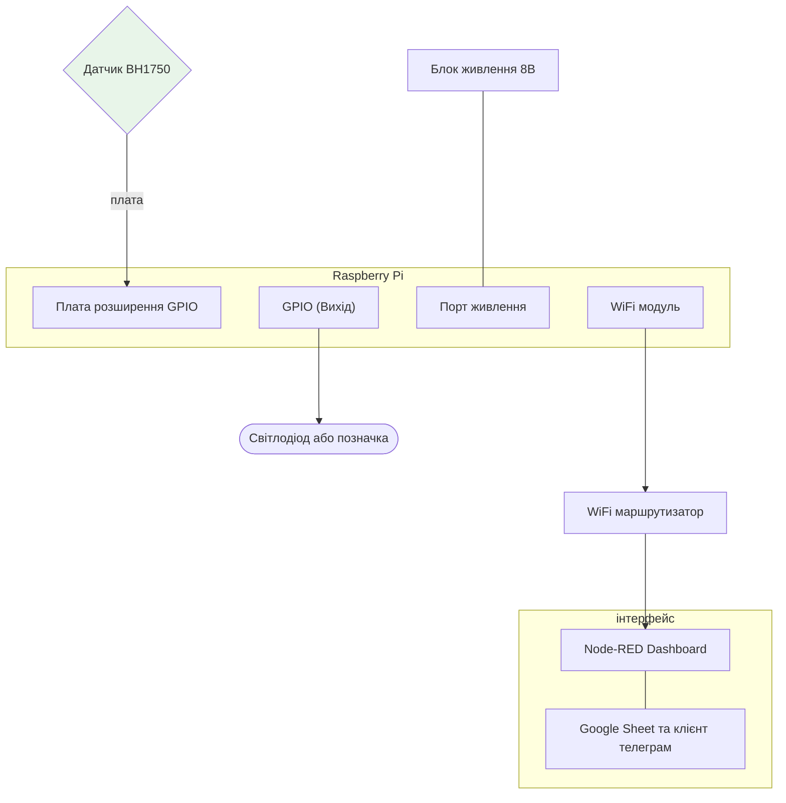
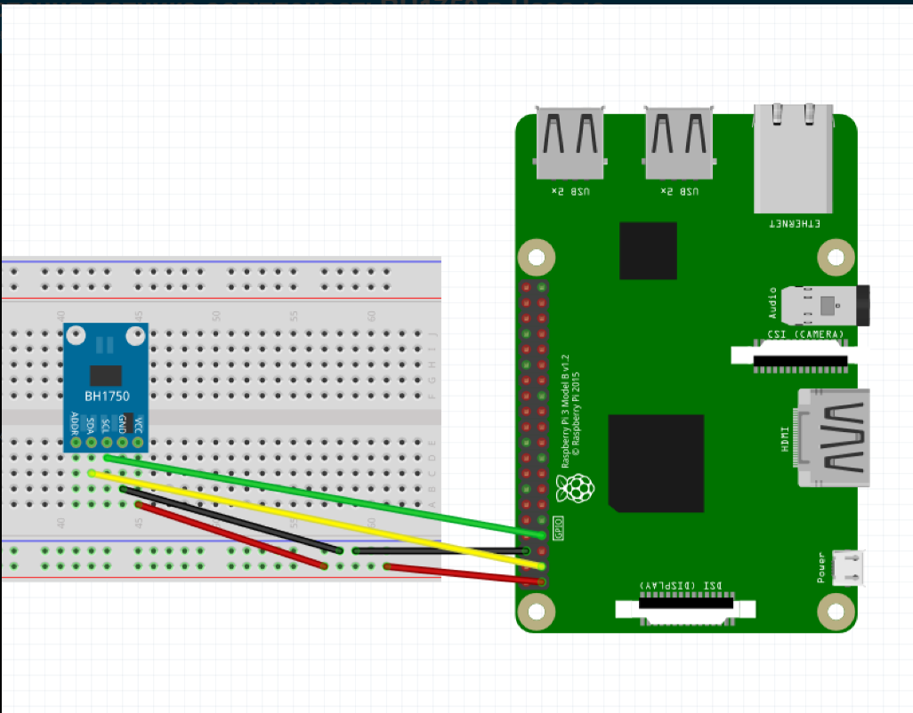

## Розділ 2. Розробка архітектури та необхідної проектної документації

### 2.1. Технічна структура системи (структура комплексу технічних засобів).

### Пояснення блок-схеми: 

Від Датчика йде сигнал на комп'ютер де обробляється та виносить данні на інтерфейс Dashboard та Googl Sheet у вигляді діаграми та статистик та за потреби для користувача на Бот в телеграмі.

## 2.2. Принципові схеми та схеми підключення.

Датчик підключенйи до макетної плати як підключена до rasberry pi

червоний контакт це живлення, чорний це заземлення,жовтий для передачі сигналу, зелений для передачі даних 

## 2.4. Програмна структура системи

| Найменування               | Кількість | Опис                                                         | Примітка                                                     |
| -------------------------- | --------- | ------------------------------------------------------------ | ------------------------------------------------------------ |
| Raspberry Pi 3             | 1         | https://arduino.ua/prod1449-raspberry-pi-3-b                 | У комплекті з корпусом, блоком живлення та картою пам'яті    |
| Макетна плата  MB-102      | 1         | https://www.google.com/aclk?sa=L&ai=DChsSEwiXke7t0PKUAxUEBaIDHShPLp0YACICCAEQCRoCbGU&co=1&ase=2&gclid=Cj0KCQjwio_RBhDMARIsAJPveNNgQhieJCQFThDhbY1shpXrCeukJpH2XgwNUbCa7abAgLNbqGblSgkaAo3jEALw_wcB&cid=CAAS3gHkaNJrYbIIbmH3WNfCqBe45KvjcXpWbD953F3GJPhZbecaBzem9l8sh8zbXO7gNvfDOQF7hlyvZj78ek-tj6RfM9riqTkzIYdrLUkE4LexpKj8V2r1SET9-dss7sA4Mx8ssNu-7scJGqxbV6uSKzWQsN7MhR-TxFUHefKBrWMdVPK2xkiqk03hZJ2Mk9r61W_YMe35Oqy9gfZqRd-puTgrIH3jDDZJFG8c50d2oI5c3RZ7zoLTy4211zdYEDPqGHcHBy1fsZEIGbcisf77gZWpXS1XipG-FCutJkDXP64&cce=2&category=acrcp_v1_32&sig=AOD64_3CxQRFN_fUecTDIXFt5oNxQVTDAg&ctype=5&q=&nis=4&ved=2ahUKEwjb1-rt0PKUAxUbGBAIHXqOAFoQ9aACKAB6BAgKED0&adurl= | макетна плата на 400 отворів                                 |
| Датчик освітленості BH1750 |           | https://www.google.com/aclk?sa=L&ai=DChsSEwihnLHZ0vKUAxVPaJEFHZYkDtIYACICCAEQCRoCbHI&co=1&ase=2&gclid=Cj0KCQjwio_RBhDMARIsAJPveNOyEaM3ntvr__AH-qUfaEkfFcxfQU_oEoawronzwTTMi__qF4QS2e0aAs8bEALw_wcB&cid=CAASuwHkaKxvjc79dfy1n_Bvq1tN0fmlbW9y5R3PzBXb-rcxKZed2tbcVZcYRpzRYM6SnTkRuRN7HiEp78rKz7PxCyKO8hA3lsnIhqy-nR6Xnegonc8uUMau0FjZYwKA5qYp_IVyrJSRQ52WjHN-O8WVM4lOUAcpC9LG6mj4qKXUfXU-_eYS0NqUqSVEL3bYjm2a4vddibZh0dDc_0y0wT2wfhEigVcOfbDfzjAvSfeQVb3IVEBizXU6sBMnmE43&cce=2&category=acrcp_v1_32&sig=AOD64_3-QdeOQI51JSQ7W8GYWQcdvl6a-w&ctype=5&q=&nis=4&ved=2ahUKEwi7lK3Z0vKUAxU1FhAIHVOcFAAQ9aACKAB6BAgFECs&adurl= | цифровий 16-бітний сенсор, який вимірює рівень освітленості в люксах |
| Світлодіод                 | 1         |                                                              |                                                              |
| Резистор 1 кОм             | 1         | https://www.google.com/aclk?sa=L&ai=DChsSEwiY546k_PKUAxVOV5EFHRVAFlkYACICCAEQBRoCbHI&co=1&ase=2&gclid=Cj0KCQjwio_RBhDMARIsAJPveNN-Fm0LCOcMKTsB92-9FRaYA1FkvnWL0w0FQ1_qfqggj0uUd8YOwy8aAk_VEALw_wcB&cid=CAAS3gHkaGnb1G7z_CRhBQ_-1OylEi8Fi6ete32SUlbTtMIml1URiGfdPpcROyBwBHd0MgVscdrksyn-uzhwLhTr9oqJIztUqqqC_FehuQ940Cpn3vazYp8ADcrKm-vbIA4dGdul9fgIw925wZ5bRLngOJEU-fuVMzo3XTdMvbTbI3NfcIVBFWLYSzMbdfxfMJglcd8Oae1-OMquTMknPY29naiPuQ_K6c8h1kApzzou6kI8YOkbC3hDArY2cT40p3JRdxuXNkrDxh51jxo5Ts1nhKenjtD2oeMXUlyg1yPJOAI&cce=2&category=acrcp_v1_32&sig=AOD64_3yRgrI5GOysClv1X5pwwaC4Dwj0g&ctype=5&q=&nis=4&ved=2ahUKEwjkooik_PKUAxUWEhAIHYEvENIQ9aACKAB6BAgJEB0&adurl= | синій резистор                                               |
| Провід dupont (мама-тато)  | 6         | https://myproject.com.ua/dyupon-z-dnuvalniy-prov-d-ua.html   | чорний, червоний, зелений і жовтий                           |

Макетна плата  MB-102    використовується для підключення датчика до rasberry pi

Raspberry Pi 3 використовується як мозок системи

Світлодіод буде показувати стан системи

Датчик освітленості BH1750 повинен на протязі дня фіксувати зміну освітлення щоб дати сигнал на увімкнення штучоного коли буде темно 

Завдяки проводу dupont (мама-тато) під'єднується мак плата до raasberry pi

Резистор 1 кОм допомагає підтримувати стан системи 

## 2.4. Програмна структура системи.

ПЗ для головної плати/сервера: операційна система:Debian база даних: СУБД MariaDB, середовища:Node.js, Node-RED.

Хмарні застосунки та клієнти ( Google Таблиці, Telegram).

ПЗ для кінцевого користувача смартфона чи ПК додатки для керування чи моніторингу ( Telegram-клієнт, веб-браузер).
