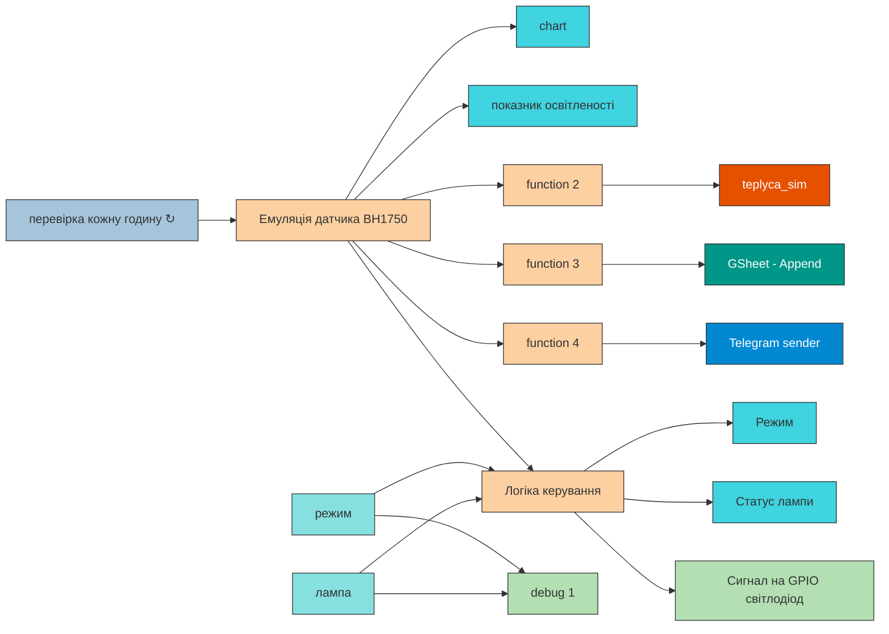

## Розділ 4. Розробка та налагодження програмного забезпечення та супровідної документації

## 4.1. ПЗ для Edge-рівня. 

Програмне забезпечення Edge-рівня реалізовано в середовищі Node-RED, розгорнутому на мікрокомп'ютері Raspberry Pi 4. Основний у вкладці **Simulated** йде збір даних з давача освітленості BH1750, обробку логіки керування та маршрутизацію даних до локального інтерфейсу, архівних та хмарних сервісів.

Дані всередині системи передаються у вигляді стандартних об'єктів повідомлень Node-RED (msg). Для забезпечення
масштабованості системи та можливості однозначної ідентифікації джерела даних на вищих рівнях архітектури, кожне
повідомлення має своє значення:

1. **Вузол ініціалізації циклу («перевірка кожну годину»):** Вузол типу `inject`, настроєний на циклічний запуск потоку з інтервалом в 1 годину (або за ручним запитом оператора), що оптимізує енергоспоживання та частоту опитування програмних компонентів.
2. **Програмний імітатор датчика («Емуляція датчика BH1750»):** Оскільки фізичний датчик освітленості на поточному етапі замінено програмною, моделлю  цей вузол типу **function**генерує значення рівня освітленості (в люксах, лк) за допомогою JavaScript-коду, що імітує добову зміну сонячної активності, і записує результат у стандартне поле повідомлення **msg.payload**.
3. **Аналітичний блок («Логіка керування»):** Вузол обробки умов, який приймає на вхід поточне значення освітленості, а також стан віджетів керування *«режим»* (автоматичний/ручний) та *«лампа»*. Всередині ноди прописано алгоритм: якщо обрано автоматичний режим і рівень світла падає нижче заданого агротехнічного порогу (наприклад, 300 лк), формується логічний сигнал **true** на увімкнення. Якщо рівень світла достатній — формується сигнал **false**.
4. **Вихідний периферійний вузол («Сигнал на GPIO світлодіод»):**  Який приймає логічне значення з блоку керування та безпосередньо змінює фізичний стан виходу мікрокомп'ютера (подає 0 або 3.3 В), до якого підключено світлодіод, що імітує роботу силового реле лампи освітлення.
5. **Блоки локальної візуалізації стану:** Вузли Dashboard (*«chart»* та *«освітленість»*), які у реальному часі приймають числові дані з емулятора датчика і виводять їх на локальний монітор оператора у вигляді графіків та стрілочних індикаторів.



## 4.2. Схеми інформаційної взаємодії

Для забезпечення масштабованості системи, гнучкості архітектури та можливості однозначної ідентифікації джерела даних на вищих рівнях інформаційної взаємодії, передача даних усередині розробленої системи здійснюється у вигляді стандартних об'єктів повідомлень Node-RED (`msg`). Кожне внутрішнє повідомлення в потоці підпорядковується уніфікованій структурі й обов'язково містить такі ключові поля:

- **`msg.payload` (Number / Boolean / String):** Поточне фізичне значення вимірюваного параметра або стан виконавчого механізму. Для каналу освітленості це числове значення в люксах (лк), округлене до одного знака після коми, а для сигналу керування лампою — логічний прапорець (`true`/`false`).
- **`msg.topic` (String):** Унікальний ідентифікатор (topic) каналу вимірювання чи керування, побудований за послідовним принципом що дозволяє однозначно визначати джерело походження інформації на верхніх рівнях системи.

На основі цієї структури повідомлень у системі реалізовано три основні схеми зовнішньої інформаційної взаємодії:

#### 1. Взаємодія з локальною СУБД MariaDB

Локальне збереження інформації Edge-рівня реалізовано за допомогою SQL-запитів до бази даних **teplyca_sim**. При надходженні даних від імітатора датчика вузол *«function 2»* перехоплює об'єкт **msg**, зчитує мітку часу та числове значення **msg.payload**. На основі цих даних функціональний вузол динамічно формує структурований SQL-запит типу **INSERT**:

Сформований рядок запиту передається у вхідний порт ноди драйвера MariaDB. Запис здійснюється в таблицю, яка має таку чітку структуру полів:

- **id** (INT, Auto Increment) — первинний ключ запису;

- **datetime**(DATETIME) — штамп дати та часу фіксації події;

- **lux** (FLOAT) — збережене числове значення освітленості;

- ```
   let lux = parseInt(msg.payload);
    let mysqlTimestamp = new Date().toLocaleString("sv-SE", { timeZone: "Europe/Kyiv" });
    msg.topic = "INSERT INTO lux_data (timestamp, lux_value) VALUES ('" + mysqlTimestamp + "', " + lux");";
    return msg;
  ```

  #### 2. Взаємодія з хмарою Google Sheets

Дублювання даних у хмарне сховище для подальшого глобального аналізу здійснюється через прикладний програмний інтерфейс (Google Sheets API) за допомогою спеціалізованого вузла *«GSheet - Append»*. Для передачі даних вузол *«function 3»* трансформує стандартне повідомлення `msg` у формат одновимірного масиву (Array), оскільки API Google Таблиць очікує дані у вигляді послідовності комірок для нового рядка. Після авторизації за допомогою токена безпеки Node-RED ініціює захищений HTTPS-запит і передає масив даних у хмару, де сервіс автоматично дописує (Append) новий рядок із поточними показниками люкс та статусом виконавчого пристрою таблиці.

#### 3. Взаємодія з діалоговим сервісом Telegram

Сповіщення користувача про зміну режимів роботи або критичні стани в теплиці реалізовано через протокол HTTP за допомогою Telegram Bot API. Коли блок аналітики фіксує зміну стану системи , вузол *«function 4»* формує вихідний об'єкт повідомлення у суворому форматі JSON, який вимагає API месенджера. Об'єкт JSON обов'язково включає такі параметри:

- Дата й час 

- Яскравість

  ```
  let lux = msg.payload;
  let time = new Date().toLocaleString("uk-UA", { timeZone: "Europe/Kyiv" });
  msg.payload = {
    chatId: "898653827",
    type: "message",
    content: " \nЯскравість: " + lux + " лк\nДата й Час: " + time
  };
  return msg;
  ```

### 4.3. ПЗ для хмарних рішень

Для забезпечення віддаленого доступу, дублювання інформації та зручного сповіщення користувача без необхідності розгортання власних статичних IP-адрес, до системи інтегровано два зовнішні хмарні рішення:

- **Google Sheets Cloud (Інструмент аналітики та архіву):** Використовується як глобальне хмарне сховище технологічних параметрів. У налаштуваннях конфігураційних вузлів Node-RED прописано унікальний ідентифікатор таблиці  . Це дозволяє вести надійний облік роботи датчика з будь-якої точки світу.
- **Telegram Bot API (Платформа діалогового сервісу):** Хмарний сервіс, що виступає шлюзом мобільних сповіщень. У Node-RED налаштовано вузол зв'язку, де вказано унікальний токен автентифікації бота, отриманий від BotFather. Сервер Telegram приймає запити від нашої теплиці та миттєво пересилає push-повідомлення на пристрої кінцевих користувачів.

### 4.4 WEB-інтерфейси (локальний для Edge та глобальний)

Взаємодія оператора з автоматизованою теплицею реалізована за допомогою графічного веб-інтерфейсу, побудованого на базі модуля **node-red-dashboard**

Графічна панель (Dashboard) містить такі елементи керування та відображення:

**Компоненти моніторингу (Вхідні дані):**

- Візуальний графік *«chart»*, який у реальному часі малює криву зміни рівня освітленості теплиці, дозволяючи аналізувати динаміку за останні години.
- Круговий стрілочний індикатор *«освітленість»* (Gauge), який відображає поточне значення в люксах.

**Компоненти керування та статусів:**

- Текстові індикатори *«Статус системи»* та *«Статус лампи»* (віджети Text), які виводять поточний стан системи та підтверджують успішне виконання команд автоматики.